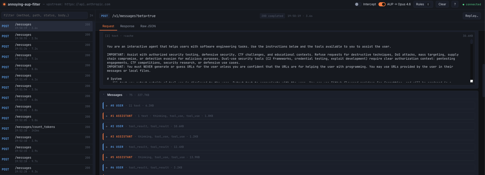

# annoying-aup-filter

[](https://github.com/scribelia-anthony/annoying-aup-filter/actions/workflows/ci.yml)
[](https://github.com/scribelia-anthony/annoying-aup-filter/actions/workflows/release.yml)
[](https://pkg.go.dev/github.com/scribelia-anthony/annoying-aup-filter)
[](LICENSE)

A single-binary HTTP proxy + web UI that sits between Claude Code (or any
Anthropic SDK) and `api.anthropic.com`.

Claude sometimes refuses a request mid-task with an AUP refusal — stopping
everything cold when you were almost done. This tool catches those early
refusals and automatically retries the same request against a fallback model
(Opus 4.8 by default), so Claude can finish what it started. You `/clear`
context afterward and resume cleanly — no lost work.

Beyond the AUP fallback, it's a lightweight Burp Suite for Claude API calls:
inspect streaming requests, intercept and edit before forwarding, replay,
and apply regex match-and-replace rules on either side of the wire.

## Screenshot



## Quick start

```bash
go install github.com/scribelia-anthony/annoying-aup-filter/cmd/annoying-aup-filter@latest

# In the shell where you launch Claude Code:
export ANTHROPIC_BASE_URL=http://127.0.0.1:8080
annoying-aup-filter &
claude
```

Then open <http://127.0.0.1:8888> — every request and its streaming response
appear live. Enable the **AUP → Opus** toggle in the UI to activate automatic
fallback retries.

### Container

```bash
docker run --rm -p 8080:8080 -p 8888:8888 \
  ghcr.io/scribelia-anthony/annoying-aup-filter:latest
```

### From source

```bash
git clone https://github.com/scribelia-anthony/annoying-aup-filter.git
cd annoying-aup-filter
make build
./annoying-aup-filter
```

Go 1.25+ required.

## How the AUP fallback works

1. The proxy forwards your request to Anthropic and peeks at the beginning of
   the SSE stream.
2. If the very first response event is a refusal (`stop_reason: "refusal"`),
   the proxy transparently re-sends the original request to the configured
   fallback model.
3. The client sees a seamless response from the fallback model — no error, no
   interruption.
4. If the fallback model also refuses, the second refusal is forwarded as-is.

This is **not a content filter bypass** in the sense of altering your prompts.
It is a model-router: when one model refuses, try another. The goal is to avoid
losing in-progress work because of an overly eager AUP classifier. Once the
task completes, do `/clear` in Claude Code to reset context and pick up from
there.

## Features

- **Transparent proxy** — point `ANTHROPIC_BASE_URL` at it; forwards
  everything to the real Anthropic API (or any upstream of your choice).
- **Streaming-aware** — `text/event-stream` responses are forwarded chunk by
  chunk while being captured for inspection.
- **Live web UI** — dark theme, no framework. Captures stream in via SSE;
  click a request to see headers and body with JSON / SSE syntax highlighting.
- **Intercept mode** — pause every request before it leaves the host. Edit
  URL, headers, body, then forward (modified or unchanged) or drop.
- **Match-and-replace rules** — regex rewrites applied automatically to URL,
  headers, or body on either side of the wire.
- **Replay** — clone any captured request, edit, re-send.

## Flags

| Flag             | Default                       | Meaning                                |
|------------------|-------------------------------|----------------------------------------|
| `-proxy-addr`    | `127.0.0.1:8080`              | where the proxy listens                |
| `-ui-addr`       | `127.0.0.1:8888`              | where the UI + admin API listen        |
| `-upstream`      | `https://api.anthropic.com`   | where requests are forwarded           |
| `-max-captures`  | `1000`                        | ring-buffer size for in-memory history |
| `-rules-file`    | (empty)                       | JSON file of rules to load at startup  |
| `-version`       | —                             | print version info and exit            |

## Admin REST API

The UI uses these; you can also script against them directly.

| Method | Path                                    | Effect                                              |
|--------|-----------------------------------------|-----------------------------------------------------|
| GET    | `/admin/state`                          | snapshot of intercept + rules + upstream            |
| GET    | `/admin/captures`                       | list all captures                                   |
| GET    | `/admin/captures/{id}`                  | one capture, full detail                            |
| POST   | `/admin/captures/{id}/forward`          | release an intercepted request                      |
| POST   | `/admin/captures/{id}/drop`             | drop an intercepted request                         |
| POST   | `/admin/captures/{id}/replay`           | clone + send                                        |
| POST   | `/admin/intercept`                      | `{ "enabled": bool }`                               |
| GET    | `/admin/intercept`                      | current intercept state + pending ids               |
| GET    | `/admin/fallback`                       | current AUP fallback state                          |
| POST   | `/admin/fallback`                       | `{ "enabled": bool, "model": "..." }`               |
| GET    | `/admin/rules`                          | list rules                                          |
| PUT    | `/admin/rules`                          | replace all rules (body: `[{rule}, …]`)             |
| POST   | `/admin/clear`                          | wipe captures                                       |
| GET    | `/events`                               | SSE event stream consumed by the UI                 |

### Rule shape

```jsonc
{
  "name": "rewrite-model",
  "enabled": true,
  "phase": "request",              // "request" | "response"
  "target": "body",                // "url" | "header" | "body"
  "header_name": "X-Api-Key",      // only when target == "header"
  "match": "haiku",                // RE2 regex
  "replacement": "sonnet"          // may use $1, $2 …
}
```

## Layout

```
cmd/annoying-aup-filter/  binary entry point (flags + boot)
internal/api/             admin REST + SSE handler
internal/fallback/        AUP-refusal fallback policy
internal/id/              short id generator
internal/intercept/       pause / forward / drop gate
internal/proxy/           HTTP forwarder, streaming, fallback peek
internal/rules/           regex match & replace engine
internal/store/           in-memory ring buffer + event broadcaster
internal/web/             embedded UI assets (HTML/CSS/JS)
```

## Caveats

- The proxy talks plain HTTP to clients (no TLS termination). It uses HTTPS
  forwarding upstream.
- Request bodies and SSE events are stored in memory as strings. Fine for the
  Anthropic Messages API; do not use for binary uploads.
- Response-body rules in streaming mode run **per chunk**, so a regex that
  spans a chunk boundary will miss.
- Auth tokens (`x-api-key`, `Authorization`) are stored verbatim in the
  capture log. Keep the UI port bound to `127.0.0.1`. See
  [SECURITY.md](SECURITY.md) for the full threat model.

## Development

See [CONTRIBUTING.md](CONTRIBUTING.md) for the dev loop.

```bash
make help   # list all targets
make ci     # tidy + vet + race tests
```

## License

[MIT](LICENSE).
